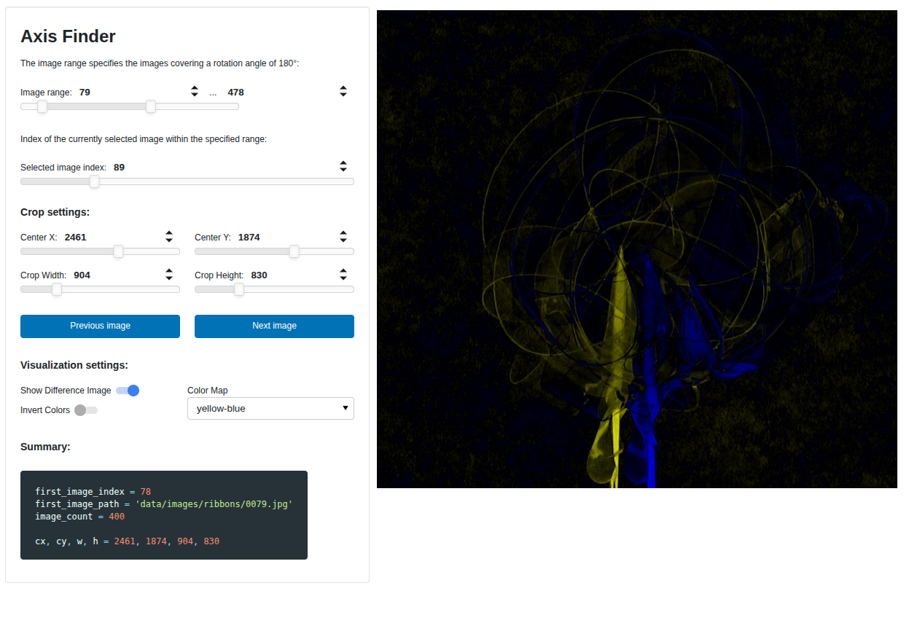

# Axis finder

This is a reimplementation of the axis finder provided in the Matlab reference implementation for the seminar on tomography at the University of Vienna (winter semester 2025/26). It is built using the dashboarding library `panel`.



## Usage

To use the axis finder, you can first install the required packages (ideally in a virtual environment) by running:

```bash
pip install -e .
```

Then the axis finder can be started with:

```bash
axis-finder path/to/image/directory
```

This will open the GUI in a browser window. 
To auto-reload the applet if you make changes to the code, you can run `axis-finder` with the `--dev` flag:

```bash
axis-finder path/to/image/directory --dev
```

### In a Jupyter Notebook

The axis finder can also be used in a Jupyter notebook. To that end, first load the required modules and make sure to enable the `panel` extension:

```python
import panel as pn
from axis_finder.app import App as AxisFinder

pn.extension()
```

The the axis finder object can be created and displayed as follows:

```python
app = AxisFinder("path/to/image/directory")
app.build()
```

#### API Reference

In the notebook, one can then also access the center position and crop dimensions as well as the image data directly via the `app` object.

### Properties
These properties map directly to the `panel` slider values.

| Property | Return Type | Description |
| :--- | :--- | :--- |
| **cx** | `float` | Current x-coordinate center for the crop area. |
| **cy** | `float` | Current y-coordinate center for the crop area. |
| **crop_width** | `float/int` | The width of the bounding box to be cropped. |
| **crop_height** | `float/int` | The height of the bounding box to be cropped. |
| **first_image_index** | `int` | The 0-based start index calculated from the image range slider. |
| **image_count** | `int` | The total number of images included in the selected range. |

---

### Methods

#### `iter_image_paths()`
A generator that yields the absolute paths of the images in the currently selected range.
* **Yields**: `str` (Path to image file)

#### `get_grayscale_cropped_image(index)`
Fetches a single image, applies the crop defined by the sliders, and returns it in grayscale.
* **Arguments**: `index` (int) - The relative index within the current selection.
* **Returns**: `np.ndarray` - The cropped grayscale image data.

#### `iter_cropped_grayscale_images()`
A lazy generator that iterates through the entire selected range and yields processed images. 
* **Yields**: `np.ndarray` - Processed image data for batch analysis.

#### `build()`
Constructs the Panel UI layout.
* **Returns**: `pn.WidgetBox` - A layout containing the sliders and controls.

---

Assuming the `app` object has been created as shown above, the properties and methods can be used as follows:

```python
# Access properties
center_x = app.cx
center_y = app.cy

print(f"Center X: {center_x}, Center Y: {center_y}")

# Iterate over image paths
for path in app.iter_image_paths():
    print(path)

# Get a single cropped grayscale image
image = app.get_grayscale_cropped_image(0)
print(image.shape)
```

An example notebook is also provided in `examples/example_notebook.ipynb`.

## Docker/Podman

The app can also be bundled in a Docker or Podman container. To build the container image, run:

```bash
docker build -t axis-finder .
```

or with Podman:

```bash
podman build -t axis-finder .
```

To run the container, use:

```bash
docker run --rm -p 5006:5006 -v path/to/image/directory:/data axis-finder /data
```

or with Podman:

```bash
podman run --rm -p 5006:5006 -v path/to/image/directory:/data axis-finder /data
```
